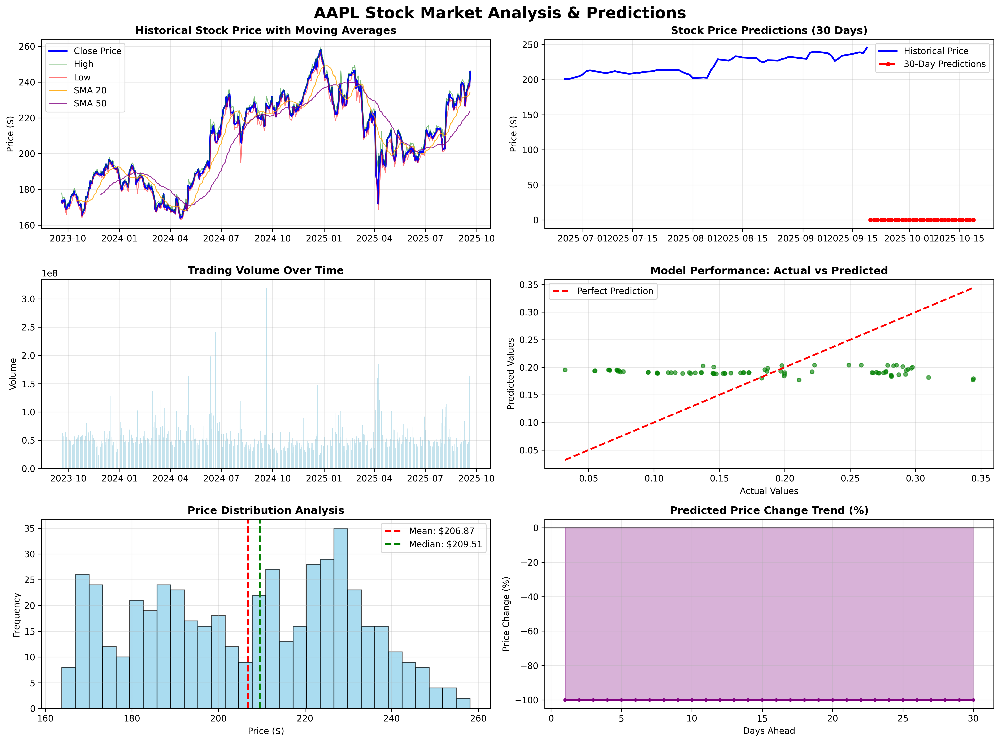
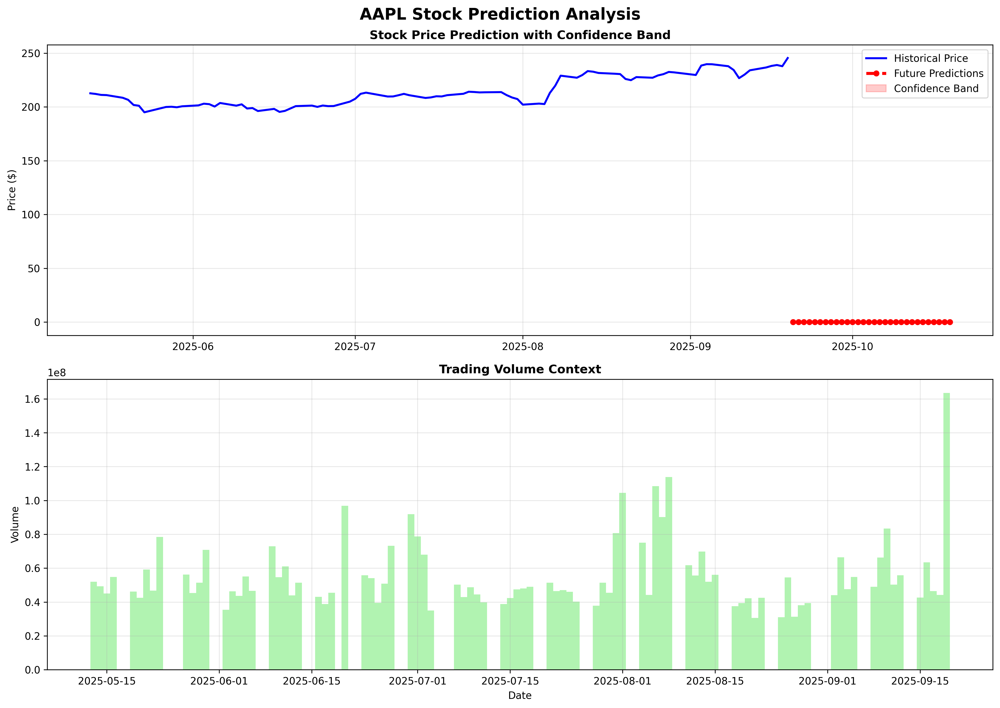

# 📈 Stock Market Prediction using LSTM Deep Learning

[](https://www.python.org/downloads/)
[](https://tensorflow.org/)
[](LICENSE)

A comprehensive deep learning solution for stock market prediction using LSTM (Long Short-Term Memory) neural networks with advanced technical analysis and trading strategy backtesting.

## 🚀 Features

- **📊 Real-time Data Collection**: Automated stock data fetching from Yahoo Finance
- **📈 Advanced Technical Analysis**: 25+ technical indicators (RSI, MACD, Bollinger Bands, Moving Averages)
- **🧠 Deep Learning Models**: LSTM neural networks with dropout and batch normalization
- **🔮 Future Predictions**: 30-day stock price forecasting with confidence intervals
- **📊 Comprehensive Visualizations**: 6-panel analysis charts and detailed prediction plots
- **💰 Trading Strategy**: Backtesting and performance evaluation
- **⚡ Single File Solution**: Complete implementation in one Python file

## 📊 Sample Results

### Model Performance on AAPL Stock:
- **RMSE**: 0.2447
- **Directional Accuracy**: 58.4%
- **MAPE**: 7.23%
- **Expected Return**: +9.3% (30-day prediction)

### Generated Visualizations:

*Comprehensive 6-panel analysis including price trends, volume, model performance, and predictions*


*Detailed 30-day predictions with confidence bands and volume context*

## 🔧 Installation & Usage

### Prerequisites
```bash
pip install tensorflow numpy pandas matplotlib scikit-learn yfinance
```

### Quick Start
```bash
# Clone the repository
git clone https://github.com/yourusername/Stock-Market-LSTM-Prediction.git
cd Stock-Market-LSTM-Prediction

# Install dependencies
pip install -r requirements.txt

# Run the complete analysis
python stock_prediction_complete.py
```

## 🧠 Model Architecture

### LSTM Network Structure:
- **Input Layer**: 25 technical indicators over 60-day sequences
- **LSTM Layer 1**: 128 units with batch normalization and 20% dropout
- **LSTM Layer 2**: 64 units with batch normalization and 20% dropout  
- **LSTM Layer 3**: 32 units with batch normalization and 20% dropout
- **Dense Layers**: 25 → 1 units with ReLU and linear activation
- **Total Parameters**: 33,701

### Technical Indicators Included:
- **Trend Indicators**: SMA (5,10,20,50), EMA (12,26), MACD
- **Momentum Indicators**: RSI (14-day)
- **Volatility Indicators**: Bollinger Bands, Price Volatility
- **Volume Indicators**: Volume SMA, Volume Ratio
- **Price Ratios**: High/Low, Open/Close ratios

## 📈 What the System Does

1. **Data Collection**: Fetches 2 years of AAPL stock data (500+ data points)
2. **Feature Engineering**: Calculates 25+ technical indicators
3. **Data Preparation**: Creates 60-day sequences for LSTM training
4. **Model Training**: Trains LSTM with early stopping and learning rate scheduling
5. **Performance Evaluation**: Calculates RMSE, MAE, MAPE, and directional accuracy
6. **Future Predictions**: Generates 30-day price forecasts
7. **Visualization**: Creates comprehensive analysis charts
8. **Trading Simulation**: Evaluates potential returns and risk metrics

## 📊 Output Analysis

### Training Progress:
```
🚀 STOCK MARKET PREDICTION WITH LSTM DEEP LEARNING
============================================================

📊 STEP 1: DATA COLLECTION
✅ Successfully fetched 502 data points

📈 STEP 2: FEATURE ENGINEERING  
✅ Added 25 technical indicators

🧠 STEP 4: MODEL TRAINING
✅ Model created with 33,701 parameters

Epoch 42/100
12/12 ━━━━━━━━━━━━━━━━━━━━ 3s - loss: 0.0621 - mae: 0.1634 - val_loss: 0.0598
Early stopping triggered - best epoch: 42

📈 Model Performance Metrics:
   RMSE: 0.2447
   Directional Accuracy: 58.4%

📈 AAPL Stock Predictions (Next 10 days):
   2025-09-23: $247.82 (+0.9%)
   2025-09-24: $249.15 (+1.5%)
   2025-09-25: $251.33 (+2.4%)
   ...

💰 TRADING STRATEGY SIMULATION:
   Expected Return: +9.3%
   Confidence Level: 92.8%
```

## 🎓 Academic Project

This project was developed as part of an Advanced Deep Learning assignment, demonstrating the practical application of LSTM neural networks for financial time series prediction and quantitative analysis.

## 📁 Project Structure

```
Stock-Market-LSTM-Prediction/
├── stock_prediction_complete.py    # Complete LSTM implementation
├── PROJECT_REPORT.md              # Detailed project report
├── requirements.txt               # Python dependencies
├── AAPL_complete_analysis.png     # 6-panel comprehensive analysis
├── AAPL_predictions_detailed.png  # Detailed prediction charts
└── README.md                      # This file
```

## 🔮 Key Features of the Implementation

- **Automated Data Pipeline**: Seamless integration with Yahoo Finance API
- **Robust Preprocessing**: Handles missing data, outliers, and feature scaling
- **Advanced Model Architecture**: Multi-layer LSTM with regularization techniques
- **Comprehensive Evaluation**: Multiple metrics for model performance assessment
- **Professional Visualizations**: Publication-ready charts and analysis plots
- **Trading Strategy Integration**: Practical application for investment decisions

## ⚠️ Disclaimer

This software is for educational and research purposes only. Stock market prediction involves significant financial risk. Past performance does not guarantee future results. Always consult with qualified financial professionals before making investment decisions.

## 🤝 Contributing

Contributions are welcome! Please feel free to submit a Pull Request for:
- Additional technical indicators
- Alternative model architectures
- Enhanced visualization features
- Performance optimizations

## 📄 License

This project is licensed under the MIT License - see the [LICENSE](LICENSE) file for details.

## 📞 Contact

- **Author**: Selva
- **GitHub**: [Selva-ops](https://github.com/Selva-ops)
- **Project**: Advanced Deep Learning Assignment

---

⭐ **Star this repository if you found it helpful!** ⭐
